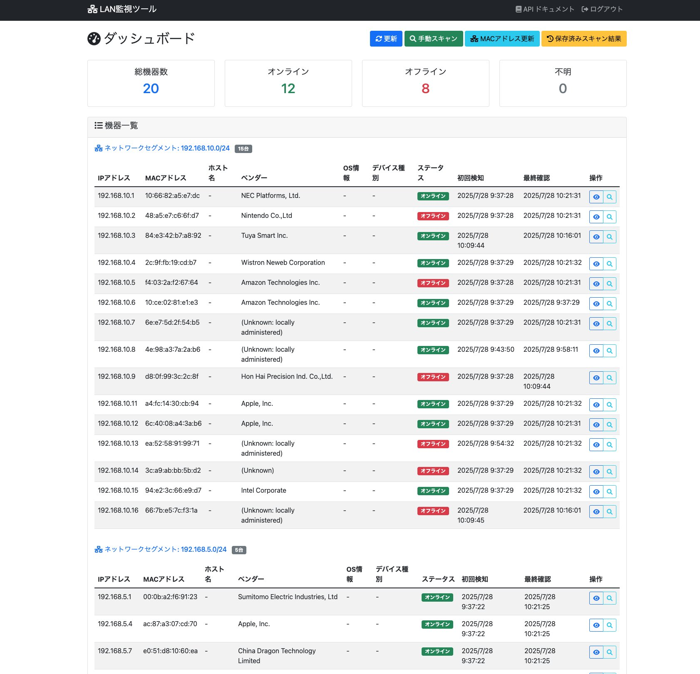
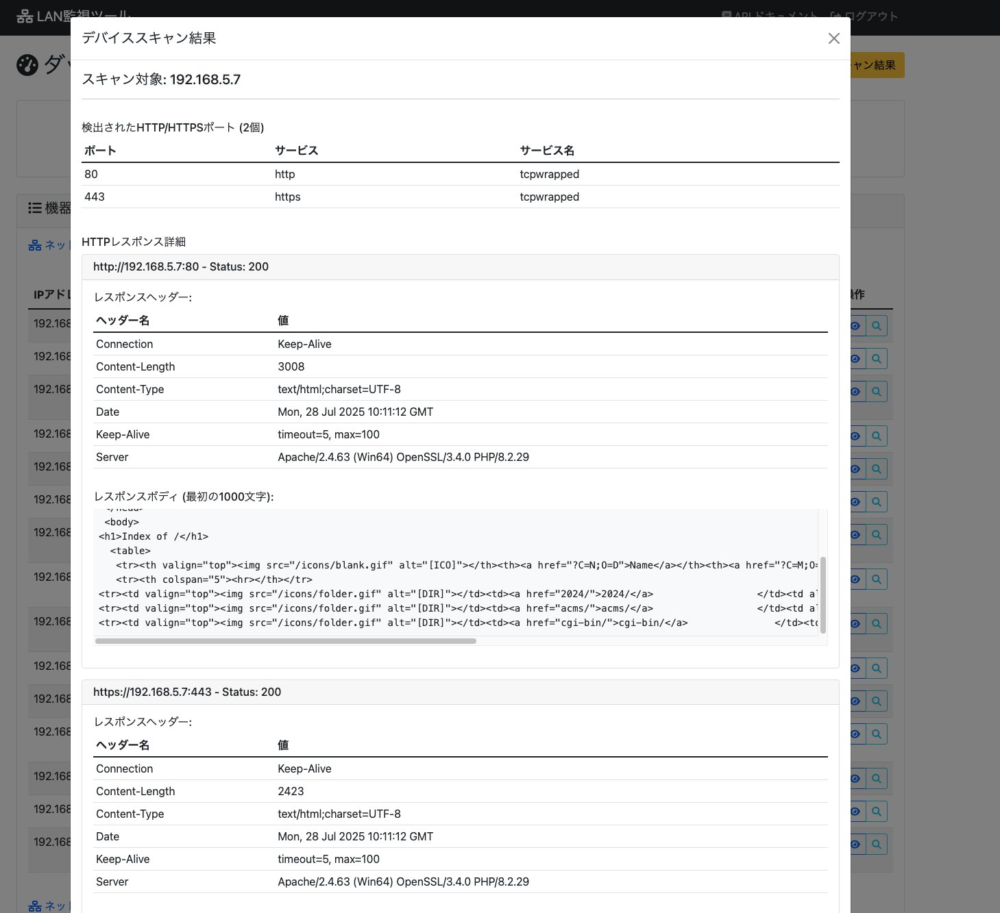

# LAN監視ツール

## 概要

LAN内に存在する機器をリアルタイムで監視し、各機器の稼働状況や詳細なポート情報を表示するWebアプリケーションです。Docker Composeを使用して簡単に起動できます。

## 必要な環境

- Docker
- Docker Compose

## クイックスタート

```bash
# リポジトリのクローン
git clone <repository-url>
cd server_observation

# 環境変数の設定（オプション）
cp .env.example .env

# Dockerイメージのビルドとサービスの起動
make build
make up
```

## アクセス方法

- **フロントエンド**: http://localhost:3000
- **バックエンドAPI**: http://localhost:8000
- **APIドキュメント**: http://localhost:8000/docs

## 使い方

### 1. ネットワークスキャン

1. ブラウザで http://localhost:3000 にアクセス
2. 「ネットワークスキャン」ボタンをクリックしてLAN内の機器を検出
3. 手動で特定のネットワーク範囲をスキャンする場合は「手動スキャン」ボタンをクリック

### 2. デバイス詳細の確認

1. 機器一覧の各行にある虫眼鏡アイコン（🔍）をクリック
2. ポートスキャン結果とHTTPレスポンス情報を確認
3. 「ポートスキャン実行」ボタンで最新の情報を取得

### 3. データの更新

- 「更新」ボタン: 既存のデバイス情報を再読み込み
- 「ネットワークスキャン」: 新しいデバイスを検出
- MACアドレスなどの情報は自動的に更新されます

## コマンド一覧

```bash
# サービスの起動
make up

# サービスの停止
make down

# サービスの再起動
make restart

# ログの表示
make logs

# クリーンアップ（データベース含む）
make clean

# データベースの初期化
make init-db
```

## システム構成

* **フロントエンド**: React + TypeScript + Bootstrap
* **バックエンド**: Python + FastAPI
* **データベース**: SQLite
* **コンテナ化**: Docker + Docker Compose

---

## 2. 画面設計

### 2-1 ダッシュボード画面

#### 表示項目

* 総機器数（全体／オンライン／オフライン／不明）
* 機器一覧（IPアドレス、MACアドレス、ホスト名、ベンダー、OS情報、ステータス、初回検知日時、最終確認日時）

#### 操作ボタン

* 更新（スキャンを再実行）
* 手動スキャン
* MACアドレス更新
* 保存済スキャン結果

#### 各行の詳細表示操作

* 「虫眼鏡アイコン」をクリックすると詳細表示をポップアップ表示

---

### 2-2 詳細情報ポップアップ画面

#### 表示項目

* スキャン対象のIPアドレス

* HTTP/HTTPSポートスキャン結果

  * ポート番号
  * サービス種別（例：http、https）
  * サービス名（例：tcpwrapped）

* HTTPレスポンス詳細

  * URL（リンク形式）
  * ステータスコード
  * レスポンスヘッダー情報（Connection、Content-Type、Serverなど）
  * レスポンスボディ（一部抜粋表示）

---

## 3. 機能設計

### 3-1 LAN内機器スキャン機能

* ネットワーク上のIPアドレス範囲を指定してスキャンを実行
* 機器のオンライン／オフラインステータスを自動判断

### 3-2 ポートスキャン機能

* 指定されたIPに対しHTTP/HTTPSポートの開放状況確認
* HTTPレスポンスヘッダとボディ情報を取得

### 3-3 データ管理機能

* スキャン結果をデータベースに保存
* MACアドレス情報の更新機能
* 過去のスキャン結果を表示可能

---

## 4. 技術要件

### 4-1 フロントエンド

* JavaScriptフレームワーク（Reactを推奨）
* レスポンシブデザイン（Bootstrap推奨）
* AJAXを用いた非同期通信

### 4-2 バックエンド

* RESTful API設計
* Pythonを使用し、FlaskまたはFastAPIフレームワークを利用

### 4-3 データベース

* SQLite（軽量アプリ向け）またはPostgreSQL（大規模向け）を使用
* ORM（SQLAlchemy推奨）を使用したデータ管理

---

## 5. セキュリティ要件

* 管理者ログイン認証（パスワード管理）
* HTTPS通信を基本とする
* 入力値のサニタイズ（XSS、SQLインジェクション防止）

---

## 6. 非機能要件

* 画面表示速度は2秒以内
* 同時接続数100ユーザーを目安に設計

---

## 7. 運用・保守要件

* 定期的なスキャンスケジュール設定
* エラーログの自動取得とアラート通知機能
* バックアップ機能（日次バックアップ）

## トラブルシューティング

### ネットワークスキャンが失敗する場合

- Dockerコンテナにネットワークアクセス権限があることを確認
- ファイアウォール設定を確認
- デフォルトのネットワーク範囲（192.168.1.0/24）が環境に合っているか確認

### ポートスキャンが失敗する場合

- 対象機器がファイアウォールでブロックされていないか確認
- Docker Composeのネットワーク設定を確認

### データベースエラーが発生する場合

```bash
# データベースの初期化
make init-db

# または完全にクリーンアップして再起動
make clean
make build
make up
```

## 環境変数

`.env`ファイルで以下の設定をカスタマイズできます：

- `SECRET_KEY`: APIのセキュリティキー
- `DEFAULT_NETWORK`: デフォルトのスキャン範囲（例: 192.168.1.0/24）
- `REACT_APP_API_URL`: フロントエンドからAPIへの接続URL

## 注意事項

- このツールは自分が管理するネットワーク内でのみ使用してください
- 他人のネットワークやデバイスに対して許可なくスキャンを実行することは違法です
- ネットワークスキャンは管理者権限が必要な場合があります

## 9.イメージ


